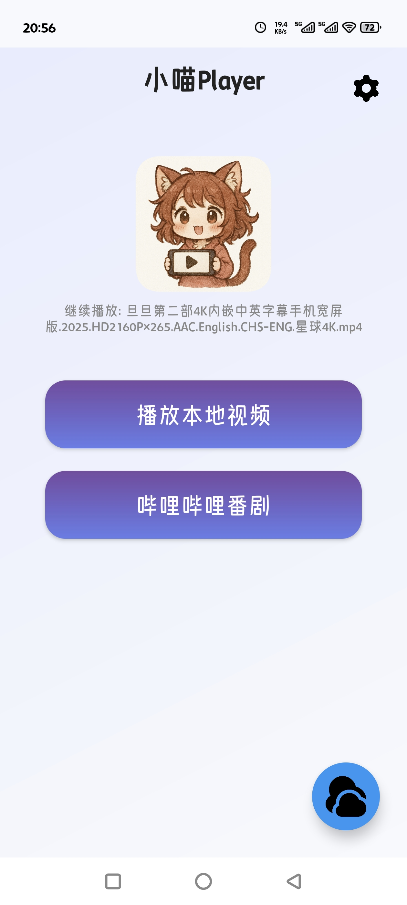
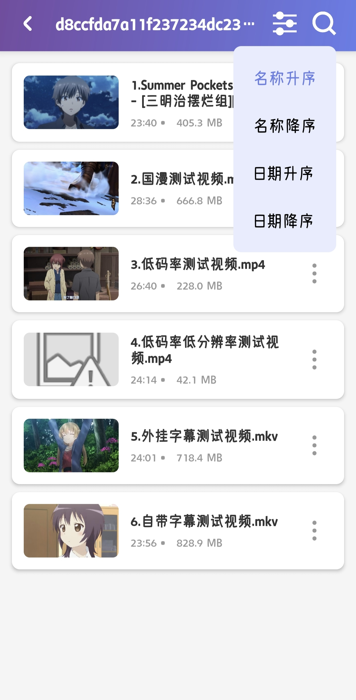
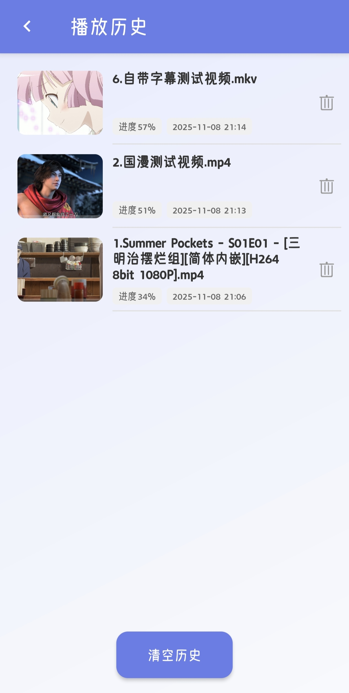
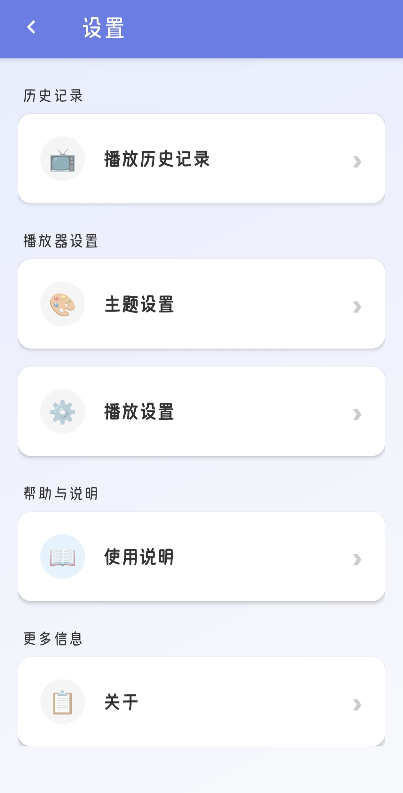
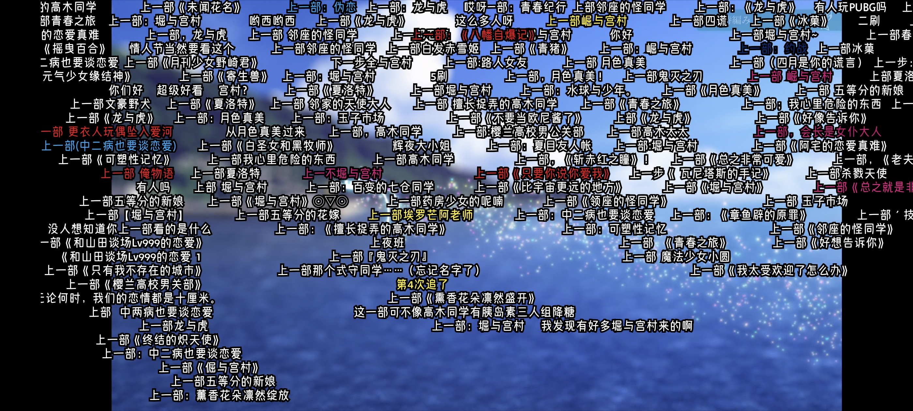
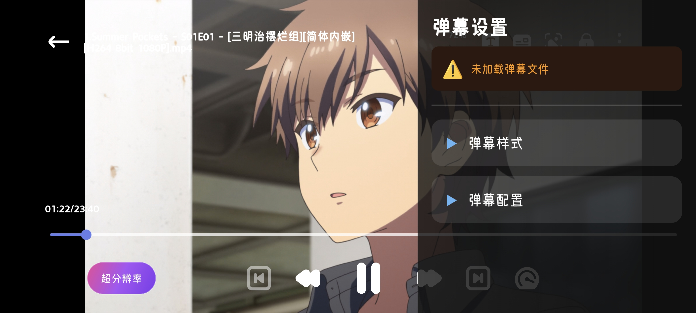
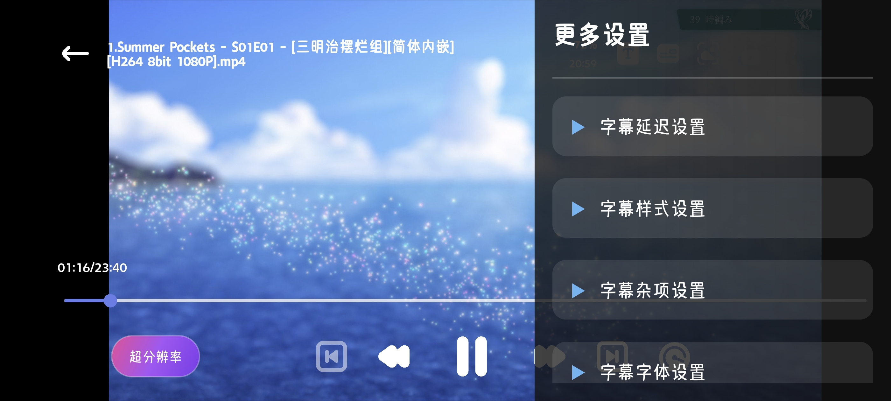
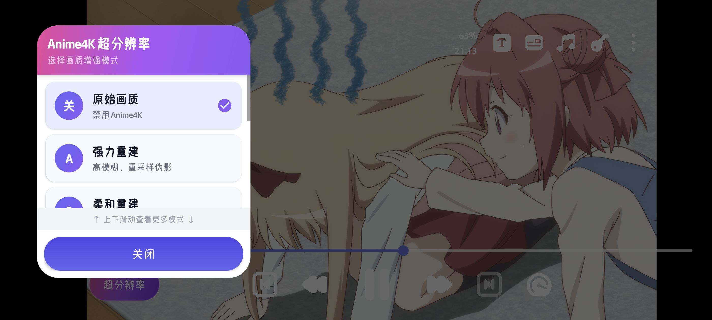

# 小喵player - 本地动漫视频实时超分播放器

**[中文版本](README.md) | [English Version](README_EN.md)**

一个基于 libmpv 的 Android 本地视频播放器，支持多种视频格式、字幕处理、手势控制和实时超分等功能。

本项目旨在将二次元动漫/动画/番剧风格的视频进行优化超分，当然你也可以当作普通的播放器使用。

## 功能截图

### 应用主界面（竖屏）

| 主页 | 视频列表与排序 | 播放历史 | 设置页 |
|------|--------------|---------|--------|
|  |  |  |  |

### 播放器界面（横屏）

| 弹幕功能 | 弹幕样式设置 |
|---------|------------|
|  |  |

| 字幕样式设置 | 超分功能 |
|------------|---------|
|  |  |

## 主要功能

- **视频播放**：支持主流视频格式（MP4、MKV、AVI 等）
- **播放列表**：自动扫描文件夹、支持视频排序和分类
- **字幕管理**：内嵌字幕解析、外部字幕导入、字幕位置和大小调整
- **音频轨道**：多音轨切换
- **音量增强**：支持开关增强功能，且可精细到0.1%调整
- **弹幕功能**：
  - 支持导入本地 XML 格式弹幕文件
  - **支持从哔哩哔哩下载弹幕**（使用B站公开API）
  - 弹幕样式自定义（大小、速度、透明度、描边等）
  - 弹幕轨道管理，支持显示/隐藏不同类型弹幕
  - 自动记忆弹幕文件和显示状态
  - 高刷新率屏幕适配（支持 90Hz/120Hz/144Hz）
  - 弹幕与视频进度同步，支持章节跳转
- **手势控制**：
  - 左侧滑动：调节亮度
  - 右侧滑动：调节音量
  - 左右滑动：快进/快退
  - 双击：暂停/播放
  - 长按：倍速播放
  - 进度条拖动：精确定位
- **播放控制**：快进/快退、倍速播放、字幕延迟调整
- **超分辨率**：集成 Anime4K，支持实时视频超分
- **播放进度恢复**：自动保存播放进度，下次打开自动续播
- **截图功能**：支持视频截图保存

## 技术架构

- **视频引擎**：libmpv（开源多媒体播放器库）
- **UI 框架**：Android AppCompat
- **编程语言**：Kotlin + Java
- **最低 SDK**：26 (Android 8.0)
- **编译 SDK**：34 (Android 14)

## 功能规划

以下功能已规划但暂未实现：

- 帧插值补帧
- 字幕字体自定义
- 字体选择
- 播放器锁定模式
- 视频缩放功能
- 在线缓存
- 在线视频播放

## 致谢

本项目离不开以下开源项目的支持：

| 项目 | 说明 |
|------|------|
| [mpv-player/mpv](https://github.com/mpv-player/mpv) | 本项目的核心基础，强大的多媒体播放器库 |
| [mpv-android/mpv-android](https://github.com/mpv-android/mpv-android) | Android 移动端实现参考 |
| [abdallahmehiz/mpv-android](https://github.com/abdallahmehiz/mpv-android/releases) | 提供现成可用的 libmpv 库文件 |
| [abdallahmehiz/mpvKt](https://github.com/abdallahmehiz/mpvKt) | 参考了手势控制、滑动处理、外部字幕导入等多项实现 |
| [bloc97/Anime4K](https://github.com/bloc97/Anime4K) | 超分辨率滤镜 GLSL 文件来源 |
| [Predidit/Kazumi](https://github.com/Predidit/Kazumi) | 项目开发灵感和原始需求 |
| [xyoye/DanDanPlayForAndroid](https://github.com/xyoye/DanDanPlayForAndroid) | 本项目大量借鉴参考了此项目的弹幕实现，非常感谢！ |
| [bilibili/DanmakuFlameMaster](https://github.com/bilibili/DanmakuFlameMaster) | 此项目的弹幕底层核心库为哔哩哔哩的Android开源弹幕解析绘制引擎项目，非常感谢！ |

## 第三方服务声明

本应用使用了以下第三方服务的公开API：

- **哔哩哔哩 (Bilibili)** - 用于下载视频和番剧弹幕
  - 视频信息API: `https://www.bilibili.com/video/*`
  - 番剧信息API: `https://api.bilibili.com/pgc/view/web/season`
  - 弹幕下载API: `https://api.bilibili.com/x/v1/dm/list.so`
  - 使用场景：用户主动输入B站视频或番剧链接时，应用会访问上述API获取弹幕数据
  - 数据处理：下载的弹幕数据仅保存在用户本地设备，不会上传或分享
  - 声明：本应用与哔哩哔哩无任何官方关联，仅使用其公开API

**隐私说明**：
- 应用不会收集或上传用户的任何个人信息
- 弹幕下载功能完全由用户主动触发
- 所有下载的数据均保存在用户指定的本地文件夹

## 开发说明

**本项目全程由 AI 完成代码开发**，本人仅负责测试、反馈和方案设计等工作。

由于 AI 生成代码的特殊性，项目中可能存在**代码冗余、结构不够精简**等问题。虽然项目已经历**两次大版本的代码结构优化**，对大部分代码进行了归类与重构，但仍可能存在以下情况：
- 部分代码逻辑较为复杂
- 存在已注释但未删除的废弃代码
- 某些实现方式不够优雅

对于优化不足之处，还望各位开发者见谅！项目仍在持续改进中，欢迎提出建议和反馈。

## 系统要求

- Android 8.0 及以上
- 至少 100MB 存储空间
- 建议 2GB 以上 RAM

## 使用方式

1. 安装应用
2. 授予文件访问权限
3. 打开应用，浏览本地视频文件
4. 点击视频即可播放

## 反馈与建议

如遇到问题或有建议，欢迎提出！

---

**Last Updated:** 2025-11-08
