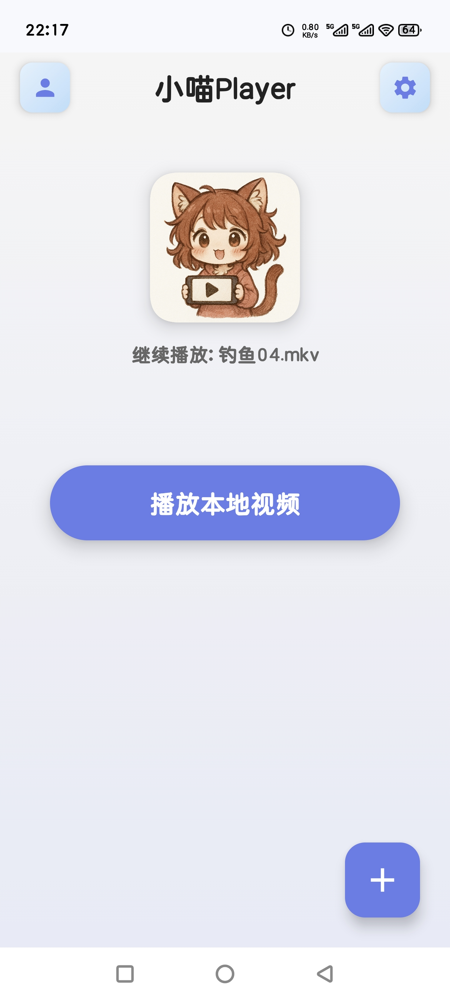
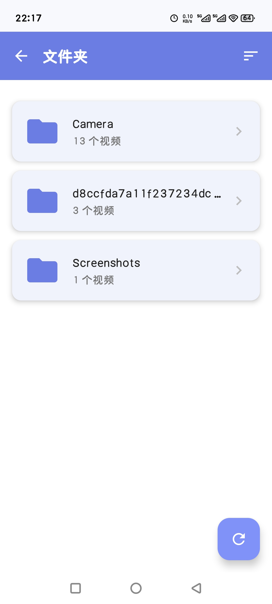
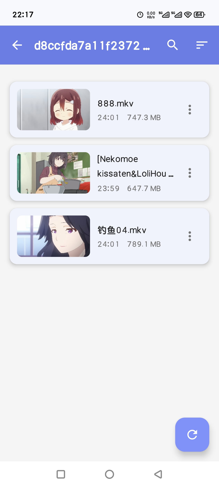
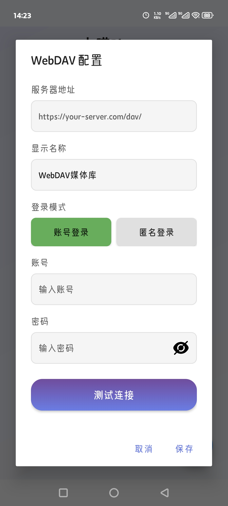
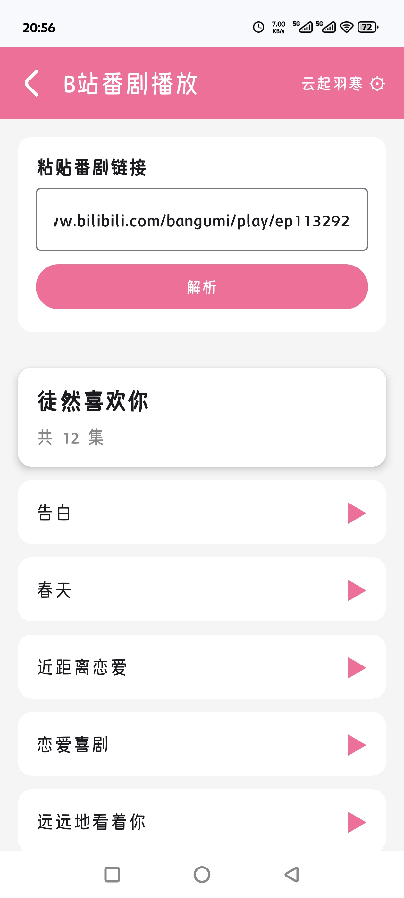
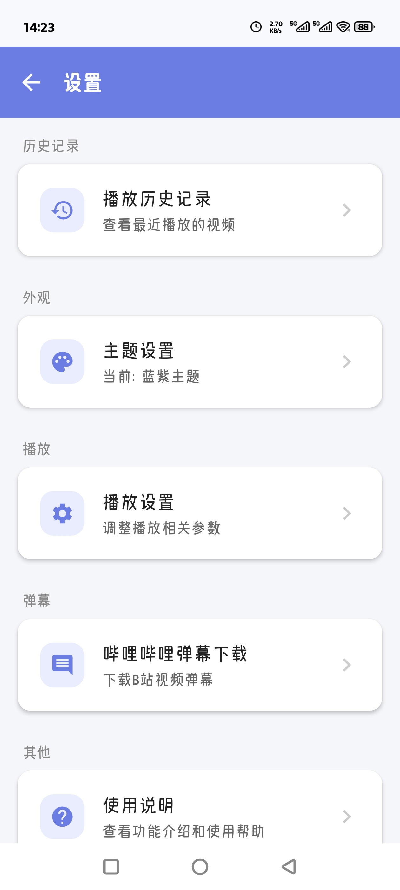
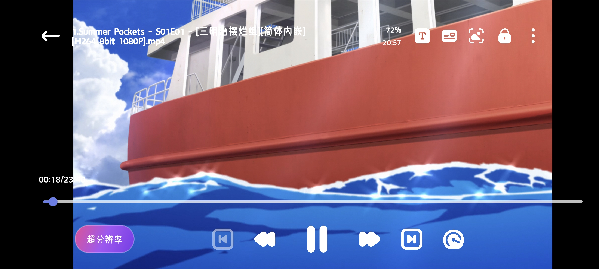
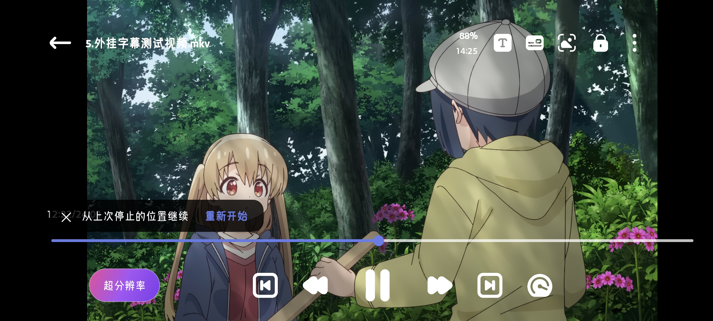
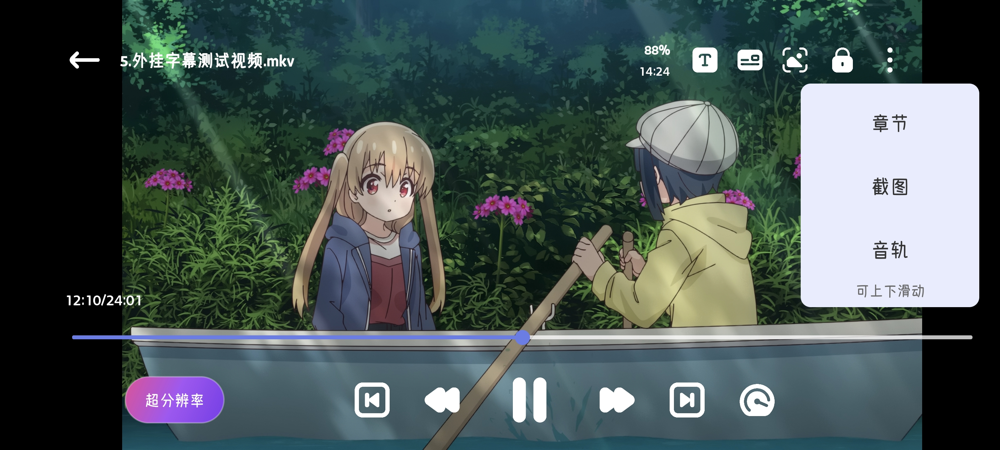

# 小喵player - 本地动漫视频实时超分播放器

**[中文版本](README.md) | [English Version](README_EN.md)**

一个基于 libmpv 的 Android 本地视频播放器，支持多种视频格式、字幕处理、手势控制和实时超分等功能。

本项目旨在将二次元动漫/动画/番剧风格的视频进行优化超分，当然你也可以当作普通的播放器使用。

---

## 声明

> [!IMPORTANT]
> 本项目遵守 [GPL-3.0-or-later](LICENSE) 开源协议，免费开源。
> 
> **任何形式的二次分发必须继续开源、遵守相同协议、保留原作者及版权信息。**

---

## ⚠️ 重要声明

**本项目旨在学习技术与测试代码，切勿滥用！**

我们强烈反对且不纵容任何形式的盗版、非法转载、黑产及其他违法用途或行为。

- 因使用本项目而产生的任何后果（包括但不限于非法用途、账号风控或其他损失），均由用户个人承担，与[本人](https://github.com/azxcvn)无关，概不负责
- 本项目 **开源免费**，作者未从中获得经济收益
- 本项目不会绕过身份验证机制、破解付费资源或实施其他非法行为
- "哔哩哔哩" 及 "Bilibili" 名称、LOGO及相关图形是上海幻电信息科技有限公司的注册商标或商标。
- 本项目为独立的第三方工具，与哔哩哔哩及其关联公司无任何关联、合作、授权或背书等关系。
- 使用本项目获取的内容，其版权归原权利人所有，请遵守相关法律法规及平台服务协议。
- 如有侵权，可随时[联系](https://github.com/azxcvn)处理。

## 素材归属
- 1.本项目图标由AI生成
- 2.本项目播放器界面的控制组件图标来自FLATICON（https://www.flaticon.com/）
- 3.其余图标来自compose架构自带图标:Material Icons；Material Icons 是由 Google 提供的开源图标库，遵循 Apache License 2.0。
---

## 功能截图

### 应用主界面（竖屏）

| 软件首页 | 文件夹列表 | 视频列表 |
|----------|------------|----------|
|  |  |  |

| webdav支持 | 番剧解析 | 设置页面 |
|------------|----------|----------|
|  |  |  |

---

### 播放器界面（横屏）

| 播放器主界面 | 弹幕样式设置 | 字幕样式设置 |
|--------------|--------------|--------------|
|  |  |  |

| 记忆播放 | 更多菜单 | 超分功能 |
|----------|----------|----------|
|  |  |  |

## 主要功能

- **视频播放**：支持主流视频格式（MP4、MKV、AVI 等）
- **网页嗅探功能**：软件内置 WebView，可以嗅探网页视频并自动选择最佳地址，一键播放
- **哔哩哔哩番剧支持**：支持登录B站账号、在线播放番剧（详见[登录实现说明](docs/bilibili_login.md)和[番剧解析原理](docs/bilibili_bangumi.md)）
- **哔哩哔哩视频/番剧下载**：支持下载B站视频和番剧到本地（详见[下载实现原理](docs/bilibili_download_principle.md)）
  - 支持完整URL、短链（b23.tv）、带文本的分享链接
  - 自动解析视频信息，支持番剧多集选择下载
  - 音视频自动合并为MP4格式
  - 支持暂停、恢复、取消下载
  - 下载进度实时显示
  - ⚠️ **仅供个人学习使用，严禁商业用途**
- **WebDAV 网络存储**：支持连接 WebDAV 服务器，直接播放云端视频文件（详见[WebDAV 使用说明](docs/webdav使用说明.md)）
- **播放列表**：自动扫描文件夹、支持视频排序和分类
- **字幕管理**：内嵌字幕解析、外部字幕导入、字幕位置和大小调整
- **字幕自动加载**：同文件夹内，同名字幕可以自动加载
- **音频轨道**：多音轨切换
- **音量增强**：支持开关增强功能，且可精细到0.1%调整
- **弹幕功能**：
  - 支持导入本地 XML 格式弹幕文件
  - **支持从哔哩哔哩下载弹幕**（详见[弹幕下载原理说明](docs/bilibili_danmaku_download.md)）
    - 使用B站分段弹幕API，获取完整弹幕数据
    - 支持普通视频和番剧整季批量下载
    - 并发下载技术，速度提升10-20倍
    - 自动携带登录Cookie，获取会员专属弹幕
  - 弹幕样式自定义（大小、速度、透明度、描边等）
  - 弹幕轨道管理，支持显示/隐藏不同类型弹幕
  - 自动记忆弹幕文件和显示状态
  - 高刷新率屏幕适配（支持 90Hz/120Hz/144Hz）
  - 弹幕与视频进度同步，支持章节跳转
- **手势控制**：
  - 左侧滑动：调节亮度
  - 右侧滑动：调节音量
  - 左右滑动：快进/快退
  - 双击：暂停/播放
  - 长按：倍速播放
  - 进度条拖动：精确定位
- **播放控制**：快进/快退、倍速播放、字幕延迟调整
- **超分辨率**：集成 Anime4K，支持实时视频超分
- **播放进度恢复**：自动保存播放进度，下次打开自动续播
- **截图功能**：支持视频截图保存

## 技术架构

- **视频引擎**：libmpv（开源多媒体播放器库）
- **UI 框架**：Android AppCompat
- **编程语言**：Kotlin + Java
- **最低 SDK**：28 (Android 9.0)
- **编译 SDK**：34 (Android 14)

## 功能规划

以下功能已规划但暂未实现：

- 帧插值补帧
- 字幕字体自定义
- 字体选择

## 致谢

本项目离不开以下开源项目的支持：

- **[mpv-player/mpv](https://github.com/mpv-player/mpv)**  
  本项目的核心基础，强大的多媒体播放器库

- **[mpv-android/mpv-android](https://github.com/mpv-android/mpv-android)**  
  Android 移动端实现参考

- **[abdallahmehiz/mpv-android](https://github.com/abdallahmehiz/mpv-android/releases)**  
  提供现成可用的 libmpv 库文件

- **[abdallahmehiz/mpvKt](https://github.com/abdallahmehiz/mpvKt)**  
  参考了手势控制、滑动处理、外部字幕导入等多项实现

- **[bloc97/Anime4K](https://github.com/bloc97/Anime4K)**  
  超分辨率滤镜 GLSL 文件来源

- **[Predidit/Kazumi](https://github.com/Predidit/Kazumi)**  
  项目开发灵感和原始需求

- **[xyoye/DanDanPlayForAndroid](https://github.com/xyoye/DanDanPlayForAndroid)**  
  参考了弹幕实现与重构以及webdav功能的实现等其他诸多功能

- **[bilibili/DanmakuFlameMaster](https://github.com/bilibili/DanmakuFlameMaster)**  
  此项目的弹幕底层核心库为哔哩哔哩的Android开源弹幕解析绘制引擎项目

- **[SocialSisterYi/bilibili-API-collect](https://github.com/SocialSisterYi/bilibili-API-collect)**  
  感谢此项目收集的公开API，将散落的API集中起来，本项目参考了其中的使用方法

- **[the1812/Bilibili-Evolved](https://github.com/the1812/Bilibili-Evolved)**  
  哔哩哔哩增强脚本，参考了弹幕下载的并发优化策略和API调用方式

- **[btjawa/BiliTools](https://github.com/btjawa/BiliTools)**  
  本项目参考了此项目的视频/番剧下载的实现原理

- **[qiusunshine/hikerView](https://github.com/qiusunshine/hikerView)**  
  本项目参考了此项目的嗅探功能实现以及某些特定情况下，需要特定反嗅探的算法逻辑

- **[thegrizzlylabs/sardine-android](https://github.com/thegrizzlylabs/sardine-android)**  
  提供了 WebDAV 协议的 Android 客户端实现，支持文件浏览、上传、下载等操作

- **[ngallagher/simplexml](https://github.com/ngallagher/simplexml)**  
  提供了轻量级的 XML 序列化框架，用于解析 WebDAV 服务器返回的 XML 格式响应数据

---

感谢以上所有开源项目和开发者的无私贡献，没有你们的努力就没有这个项目的诞生！

## 第三方服务声明

本应用使用了以下第三方服务的公开API：

- **哔哩哔哩 (Bilibili)** - 用于登录、解析番剧链接并在线播放、下载弹幕、下载视频/番剧
  - 登录API: `https://passport.bilibili.com/x/passport-login/web/qrcode/*`
  - 番剧信息API: `https://api.bilibili.com/pgc/view/web/season`
  - 番剧播放API: `https://api.bilibili.com/pgc/player/web/playurl`
  - 弹幕下载API: `https://api.bilibili.com/x/v1/dm/list.so`
  - 视频信息API: `https://api.bilibili.com/x/web-interface/view`
  - 视频下载API: `https://api.bilibili.com/x/player/playurl`
  - 番剧下载API: `https://api.bilibili.com/pgc/player/web/playurl`
  - 使用场景：
    - 用户主动扫码登录B站账号
    - 用户输入番剧链接观看在线番剧
    - 用户主动输入B站视频链接下载弹幕
  - 数据处理：
    - 登录凭证使用AES-256加密存储在本地，详见[安全说明](docs/bilibili_security_analysis.md)
    - 下载的弹幕数据仅保存在用户本地设备
    - 所有数据不会上传或分享给第三方
  - 声明：本应用与哔哩哔哩无任何官方关联，仅使用其公开API

**隐私说明**：

本应用高度重视用户隐私保护，特此说明：

### 数据收集
- ❌ **不收集**用户的任何个人信息
- ❌ **不上传**任何数据到我们的服务器（我们没有服务器）
- ❌ **不分享**用户数据给任何第三方
- ✅ 所有功能均在**本地设备**上运行

### 哔哩哔哩登录功能
- 登录凭证使用 **AES-256 军事级加密** 存储在本地（详见[安全分析](docs/bilibili_security_analysis.md)）
- 登录密钥由 Android KeyStore 硬件保护，**应用无法导出**
- 登录信息仅用于调用B站API，**不会上传到任何其他地方**
- 用户可随时在设置中**一键退出登录**，彻底清除所有登录数据
- 应用卸载后，所有登录数据将**自动永久销毁**

### 弹幕与番剧数据
- 弹幕文件和番剧数据保存在**用户指定的本地文件夹**
- 下载功能完全由**用户主动触发**
- 数据仅存储在本地，**不会同步或备份到云端**

### 视频/番剧下载功能
- ⚠️ **重要提醒**：视频下载功能仅供**个人学习与技术交流**使用
- 下载的视频内容**版权归原作者所有**，请在下载后24小时内删除
- **严禁用于任何商业用途**，包括但不限于：
  - 二次传播、倒卖、去水印上传
  - 商业放映、广告盈利
  - 侵犯版权方权益的任何行为
- 使用下载功能产生的**法律责任由用户自行承担**，与本项目无关
- 本项目不对下载功能的滥用负责，请遵守相关法律法规
- 建议仅下载自己有版权或创作的内容，尊重UP主和版权方的劳动成果

### 权限说明
应用仅请求以下必要权限：
- **存储权限（管理所有文件）**：读取和保存本地视频、字幕、弹幕文件，自动加载同名字幕文件
- **网络权限**：用于哔哩哔哩番剧在线播放、视频/番剧下载和弹幕下载（用户主动触发）

### 开源透明
- ✅ 项目**完全开源**，所有代码公开可审查
- ✅ 欢迎安全专家进行代码审计
- ✅ 如发现安全问题，请及时反馈

**承诺**：本应用永远不会售卖或共享用户数据，因为我们根本不收集！

## 开发说明

**本项目全程由 AI 完成代码开发**，本人仅负责测试、反馈和方案设计等工作。

由于 AI 生成代码的特殊性，项目中可能存在**代码冗余、结构不够精简**等问题。虽然项目已经历**两次大版本的代码结构优化**，对大部分代码进行了归类与重构，但仍可能存在以下情况：
- 部分代码逻辑较为复杂
- 存在已注释但未删除的废弃代码
- 某些实现方式不够优雅

对于优化不足之处，还望各位开发者见谅！项目仍在持续改进中，欢迎提出建议和反馈。

## 系统要求

- Android 9.0 及以上
- 至少 64GB 存储空间
- 建议 8GB 以上 RAM

## 使用方式

1. 安装应用
2. 授予文件访问权限
3. 打开应用，浏览本地视频文件
4. 点击视频即可播放

## 反馈与建议

如遇到问题或有建议，欢迎提出！

---

**Last Updated:** 2025-12-02
