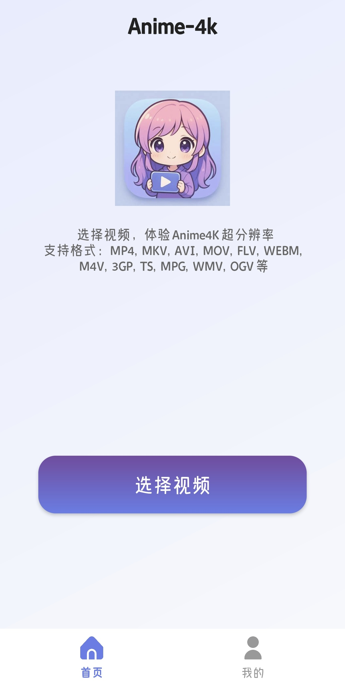
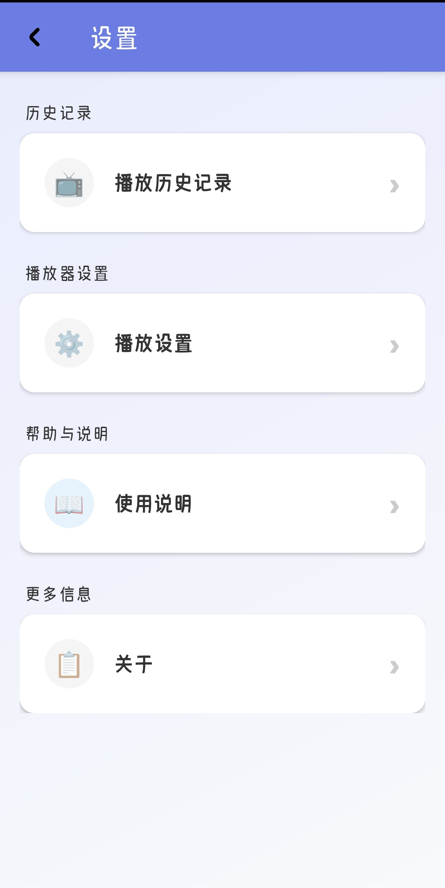
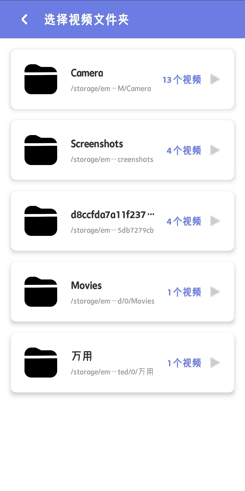
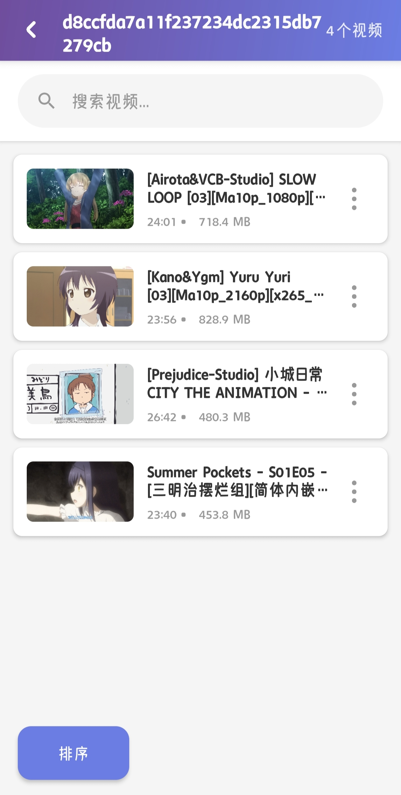

# FAMPV4K - Local Video Player

An Android local video player based on libmpv, supporting multiple video formats, subtitle processing, gesture controls, and real-time upscaling features.

## About the Name

**FAM4K007** is an abbreviation for **For Anime Media Player Video 4K**:
- **F**or - For
- **A**nime - Anime
- **M**edia - Media
- **P**layer - Player
- **V**ideo - Video
- **4K** - Ultra high definition resolution
- **007** - Continuous numbering

This name reflects the software's primary positioning as a high-definition local video player optimized for anime enthusiasts.

## Screenshots

| Home | Playback | Settings |
|------|----------|----------|
|  |  |  |

| Subtitle Management | Playback Control |
|-------------------|------------------|
|  |  |

## Key Features

- **Video Playback**: Support for mainstream video formats (MP4, MKV, AVI, etc.)
- **Playlist Management**: Automatic folder scanning, video sorting and categorization
- **Subtitle Handling**: Built-in subtitle parsing, external subtitle import, subtitle position and size adjustment
- **Audio Tracks**: Multi-track audio switching
- **Gesture Controls**:
  - Left swipe: Adjust brightness
  - Right swipe: Adjust volume
  - Two-finger pinch: Video zoom
- **Playback Controls**: Fast forward/rewind, speed control, subtitle delay adjustment
- **Super-Resolution**: Integrated Anime4K for real-time video upscaling
- **Resume Playback**: Automatically saves playback progress and resumes from where you left off
- **Screenshot**: Support for video screenshot capture

## Technical Architecture

- **Video Engine**: libmpv (Open-source multimedia player library)
- **UI Framework**: Android AppCompat
- **Programming Language**: Kotlin + Java
- **Minimum SDK**: 26 (Android 8.0)
- **Compile SDK**: 34 (Android 14)

## Known Issues

| Issue | Description |
|-------|-------------|
| Missing Thumbnails | Video list thumbnails may disappear after pull-to-refresh |
| Sorting Delay | Sorting function may need to be executed twice initially |
| Duplicate Video Loading | Videos are reloaded once at the beginning to fix subtitle display issues |
| Embedded + External Subtitle Conflict | Do not import external subtitles for videos with embedded subtitles |
| Black Screen on Subtitle Import | Very rare: importing external subtitles may cause black screen; go back and re-enter to recover |

## Planned Features

The following features are planned but not yet implemented:

- Danmaku (bullet comments)
- Frame interpolation
- Subtitle font customization
- Font selection
- Player lock mode
- Video zoom functionality
- Online caching
- Online video playback
- UI themes and dark mode

## Acknowledgments

This project would not be possible without the support of the following open-source projects:

| Project | Description |
|---------|-------------|
| [mpv-player/mpv](https://github.com/mpv-player/mpv) | The core foundation of this project, a powerful multimedia player library |
| [mpv-android/mpv-android](https://github.com/mpv-android/mpv-android) | Reference implementation for Android mobile |
| [jarnedemeulemeester/libmpv-android](https://github.com/jarnedemeulemeester/libmpv-android) | Provides ready-to-use libmpv library files |
| [abdallahmehiz/mpvKt](https://github.com/abdallahmehiz/mpvKt) | Reference for gesture controls, swipe handling, and external subtitle import |
| [bloc97/Anime4K](https://github.com/bloc97/Anime4K) | Source of super-resolution GLSL shader files |
| [Predidit/Kazumi](https://github.com/Predidit/Kazumi) | Project development inspiration and original requirements |

## Development Notes

**This project was entirely developed by AI** for code implementation, with the author responsible for testing, feedback, and solution design.

Due to the nature of AI-generated code, the project may contain code redundancy or less optimized implementations. Thank you for your understanding.

## System Requirements

- Android 8.0 or higher
- At least 100MB storage space
- Recommended 2GB or more RAM

## Usage

1. Install the application
2. Grant file access permissions
3. Open the app and browse local video files
4. Click on a video to start playback

## Feedback and Suggestions

If you encounter any issues or have suggestions, please feel free to report them!

---

**Last Updated:** 2025-10-26

**[中文版本](README.md) | [English Version](README_EN.md)**
