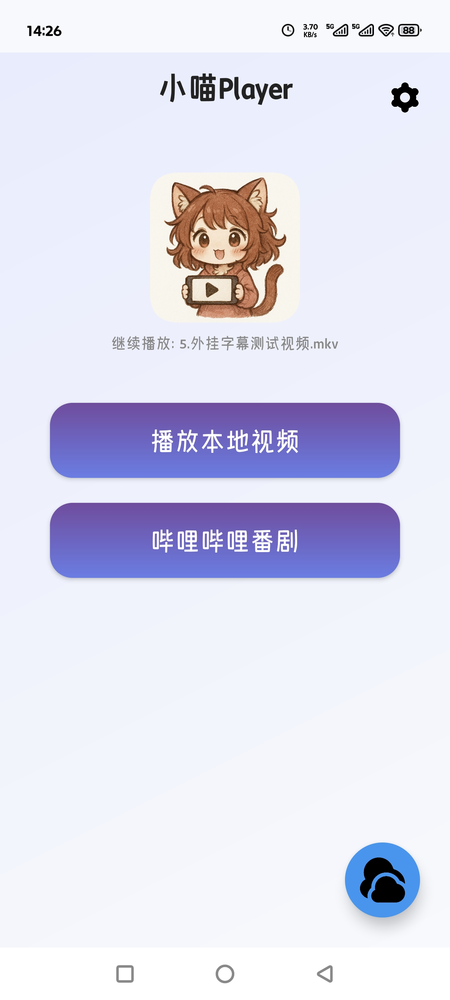

# XiaoMiao Player - Local Video Player

**[中文版本](README.md) | [English Version](README_EN.md)**

An Android local video player based on libmpv, supporting multiple video formats, subtitle processing, gesture controls, and real-time upscaling features.

This project aims to optimize and upscale anime-style videos, though it can also be used as a regular video player.

## Screenshots

### Application Interface (Portrait)

| Home | Folder List | Video List |
|------|------------|------------|
|  |  |  |

| WebDAV Feature | Bangumi Parsing | Settings Page |
|----------------|----------------|----------------|
|  |  |  |

---

### Player Interface (Landscape)

| Player Main Interface | Danmaku Styling | Subtitle Styling |
|----------------------|----------------|------------------|
|  |  |  |

| Resume Playback | More Menu | Super-Resolution |
|----------------|-----------|------------------|
|  |  |  |

## Key Features

- **Video Playback**: Support for mainstream video formats (MP4, MKV, AVI, etc.)
- **Bilibili Bangumi Support**: Login to Bilibili account, stream bangumi online (see [Login Implementation](docs/bilibili_login.md) and [Bangumi Parsing Principle](docs/bilibili_bangumi.md))
- **WebDAV Network Storage**: Connect to WebDAV servers and stream cloud-hosted videos directly (see [WebDAV Usage Guide](docs/webdav使用说明.md))
- **Playlist Management**: Automatic folder scanning, video sorting and categorization
- **Subtitle Handling**: Built-in subtitle parsing, external subtitle import, subtitle position and size adjustment
- **Audio Tracks**: Multi-track audio switching
- **Volume Boost**: Toggle volume boost feature with fine-grained 0.1% adjustment
- **Danmaku Features**:
  - Support for importing local XML format danmaku files
  - **Support for downloading danmaku from Bilibili** (see [Danmaku Download Principle](docs/bilibili_danmaku_download.md))
    - Uses Bilibili's segmented danmaku API for complete data retrieval
    - Supports batch downloads for regular videos and entire bangumi seasons
    - Concurrent download technology, 10-20x speed improvement
    - Automatically includes login cookies to access premium danmaku
  - Customizable danmaku styles (size, speed, transparency, stroke, etc.)
  - Danmaku track management, show/hide different types of danmaku
  - Auto-save danmaku files and display states
  - High refresh rate screen adaptation (supports 90Hz/120Hz/144Hz)
  - Danmaku synchronization with video progress, supports chapter jumping
- **Gesture Controls**:
  - Left swipe: Adjust brightness
  - Right swipe: Adjust volume
  - Horizontal swipe: Fast forward/rewind
  - Double tap: Pause/play
  - Long press: Speed up playback
  - Progress bar drag: Precise positioning
- **Playback Controls**: Fast forward/rewind, speed control, subtitle delay adjustment
- **Super-Resolution**: Integrated Anime4K for real-time video upscaling
- **Resume Playback**: Automatically saves playback progress and resumes from where you left off
- **Screenshot**: Support for video screenshot capture

## Technical Architecture

- **Video Engine**: libmpv (Open-source multimedia player library)
- **UI Framework**: Android AppCompat
- **Programming Language**: Kotlin + Java
- **Minimum SDK**: 26 (Android 8.0)
- **Compile SDK**: 34 (Android 14)

## Planned Features

The following features are planned but not yet implemented:

- Frame interpolation
- Subtitle font customization
- Font selection

## Acknowledgments

This project would not be possible without the support of the following open-source projects:

- **[mpv-player/mpv](https://github.com/mpv-player/mpv)**  
  The core foundation of this project, a powerful multimedia player library

- **[mpv-android/mpv-android](https://github.com/mpv-android/mpv-android)**  
  Reference implementation for Android mobile

- **[abdallahmehiz/mpv-android](https://github.com/abdallahmehiz/mpv-android/releases)**  
  Provides ready-to-use libmpv library files

- **[abdallahmehiz/mpvKt](https://github.com/abdallahmehiz/mpvKt)**  
  Reference for gesture controls, swipe handling, and external subtitle import

- **[bloc97/Anime4K](https://github.com/bloc97/Anime4K)**  
  Source of super-resolution GLSL shader files

- **[Predidit/Kazumi](https://github.com/Predidit/Kazumi)**  
  Project development inspiration and original requirements

- **[xyoye/DanDanPlayForAndroid](https://github.com/xyoye/DanDanPlayForAndroid)**  
  Referenced danmaku implementation and refactoring, WebDAV functionality implementation, and many other features

- **[bilibili/DanmakuFlameMaster](https://github.com/bilibili/DanmakuFlameMaster)**  
  The danmaku core engine for this project is Bilibili's open-source danmaku parsing and rendering engine

- **[SocialSisterYi/bilibili-API-collect](https://github.com/SocialSisterYi/bilibili-API-collect)**  
  Thanks for collecting public APIs and centralizing scattered APIs. This project referenced the usage methods

- **[the1812/Bilibili-Evolved](https://github.com/the1812/Bilibili-Evolved)**  
  Bilibili enhancement script, referenced concurrent optimization strategies and API calling methods for danmaku downloads

- **[thegrizzlylabs/sardine-android](https://github.com/thegrizzlylabs/sardine-android)**  
  Provides Android WebDAV client implementation, supporting file browsing, uploading, and downloading operations

- **[ngallagher/simplexml](https://github.com/ngallagher/simplexml)**  
  Provides a lightweight XML serialization framework for parsing XML format response data from WebDAV servers

---

Thanks to all the above open-source projects and developers for their selfless contributions. Without your efforts, this project would not have been possible!

## Third-Party Service Disclosure

This application uses public APIs from the following third-party services:

- **Bilibili** - For login, parsing bangumi links for online streaming, and downloading danmaku
  - Login API: `https://passport.bilibili.com/x/passport-login/web/qrcode/*`
  - Bangumi Info API: `https://api.bilibili.com/pgc/view/web/season`
  - Bangumi Playback API: `https://api.bilibili.com/pgc/player/web/playurl`
  - Danmaku Download API: `https://api.bilibili.com/x/v1/dm/list.so`
  - Usage Scenarios:
    - User actively scans QR code to login to Bilibili account
    - User inputs bangumi link to watch online bangumi
    - User actively inputs Bilibili video link to download danmaku
  - Data Processing:
    - Login credentials are encrypted with AES-256 and stored locally, see [Security Documentation](docs/bilibili_security_analysis.md)
    - Downloaded danmaku data is only saved on the user's local device
    - All data will not be uploaded or shared with third parties
  - Disclaimer: This application has no official affiliation with Bilibili and only uses its public APIs

**Privacy Statement**:

This application highly values user privacy protection. Here is our statement:

### Data Collection
- ❌ **Does NOT collect** any user personal information
- ❌ **Does NOT upload** any data to our servers (we don't have servers)
- ❌ **Does NOT share** user data with any third parties
- ✅ All features run **locally on device**

### Bilibili Login Feature
- Login credentials are encrypted with **AES-256 military-grade encryption** and stored locally (see [Security Analysis](docs/bilibili_security_analysis.md))
- Login keys are protected by Android KeyStore hardware, **cannot be exported by the app**
- Login information is only used for Bilibili API calls, **not uploaded anywhere else**
- Users can **logout with one click** in settings to completely clear all login data
- After app uninstallation, all login data will be **automatically and permanently destroyed**

### Danmaku and Bangumi Data
- Danmaku files and bangumi data are saved in **user-specified local folders**
- Download features are entirely **user-initiated**
- Data is only stored locally, **not synced or backed up to cloud**

### Permission Statement
The app only requests the following necessary permissions:
- **Storage Permission**: Read and save local videos, subtitles, and danmaku files
- **Network Permission**: For Bilibili bangumi online streaming and danmaku downloads (user-initiated)

### Open Source Transparency
- ✅ Project is **completely open source**, all code is publicly auditable
- ✅ Welcome security experts to conduct code audits
- ✅ If security issues are found, please report them promptly

**Commitment**: This application will never sell or share user data, because we don't collect any in the first place!

## Development Notes

**This project was entirely developed by AI** for code implementation, with the author responsible for testing, feedback, and solution design.

Due to the nature of AI-generated code, the project may contain issues such as **code redundancy and less streamlined structure**. Although the project has undergone **two major code structure optimizations** with comprehensive refactoring and reorganization, the following situations may still exist:
- Some code logic may be complex
- Deprecated code that has been commented out but not removed
- Some implementation approaches may not be elegant

We apologize for any optimization shortcomings! The project is still under continuous improvement, and suggestions and feedback are welcome.

## System Requirements

- Android 8.0 or higher
- At least 100MB storage space
- Recommended 2GB or more RAM

## Usage

1. Install the application
2. Grant file access permissions
3. Open the app and browse local video files
4. Click on a video to start playback

## Feedback and Suggestions

If you encounter any issues or have suggestions, please feel free to report them!

---

**Last Updated:** 2025-11-16

**[中文版本](README.md) | [English Version](README_EN.md)**
