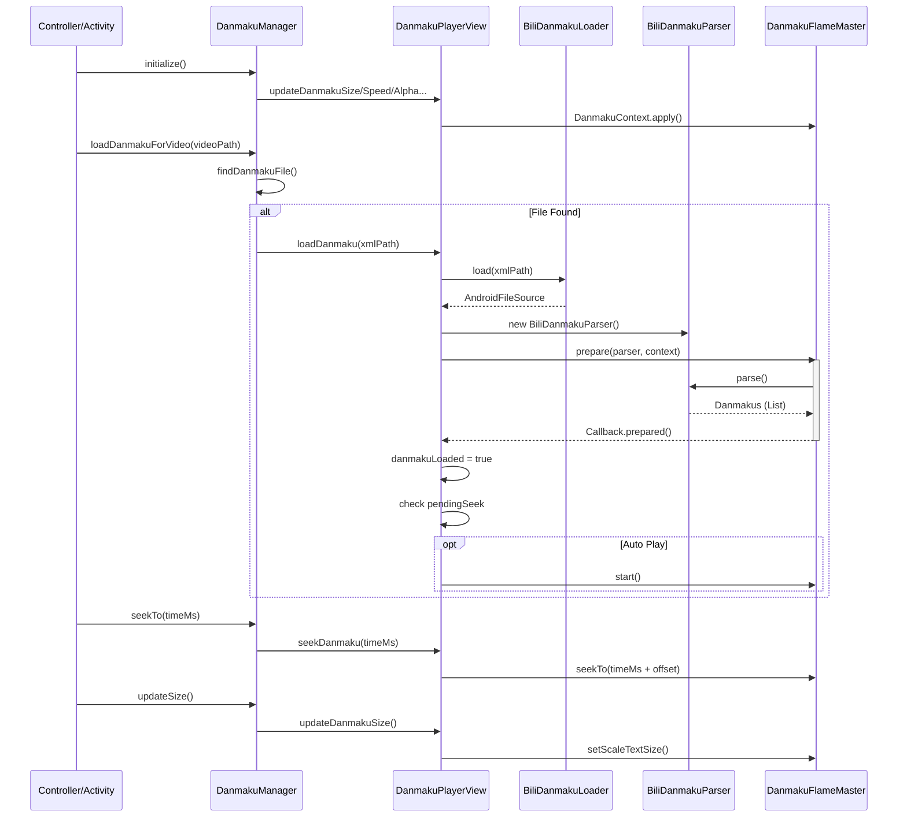

# 安卓播放器弹幕功能实现分析

## 1. 架构概览

本项目的弹幕功能基于开源库 **DanmakuFlameMaster** (烈焰弹幕使) 实现，采用了经典的 MVP (Model-View-Presenter) 变体结构。主要通过解析 Bilibili 格式的 XML 弹幕文件，将其转换为弹幕对象，并在视频播放层之上进行绘制。

## 2. 核心类及其职责

| 类名 | 路径 | 职责 |
| :--- | :--- | :--- |
| **DanmakuManager** | `.../danmaku/DanmakuManager.kt` | **业务逻辑控制器**。负责弹幕系统的初始化、文件查找逻辑、播放控制（开始/暂停/Seek）、样式配置的应用。它是外部（如播放器 Activity）与弹幕系统交互的统一入口。 |
| **DanmakuPlayerView** | `.../danmaku/DanmakuPlayerView.kt` | **UI 视图组件**。继承自 `DanmakuView`。封装了底层 `DanmakuContext` 的配置（防重叠、缓存等），处理 `DrawHandler` 回调，并管理弹幕的加载状态和可见性。 |
| **BiliDanmakuParser** | `.../danmaku/BiliDanmakuParser.java` | **数据解析器**。继承自 `BaseDanmakuParser`。使用 SAX 解析器处理 Bilibili XML 格式的弹幕数据，将 XML 标签转换为 `BaseDanmaku` 实体。支持普通弹幕和部分高级代码弹幕。 |
| **BiliDanmakuLoader** | `.../danmaku/BiliDanmakuLoader.java` | **数据加载器**。负责将文件路径或流转换为 `AndroidFileSource`，供解析器使用。 |
| **DanmakuConfig** | `.../danmaku/DanmakuConfig.kt` | **配置管理器**。单例对象，管理所有弹幕相关的设置（开关、大小、速度、透明度、区域限制等），并负责与 `PreferencesManager` 交互进行持久化存储。 |

## 3. 弹幕加载与渲染流程

### 3.1 初始化阶段
1.  `DanmakuManager.initialize()` 被调用。
2.  `DanmakuConfig.init(context)` 加载本地存储的配置。
3.  `DanmakuManager` 调用 `DanmakuPlayerView` 的一系列 `update...()` 方法，将配置应用到视图层。
4.  `DanmakuPlayerView` 创建并配置 `DanmakuContext`（设置防重叠、缓存模式、更新策略）。

### 3.2 加载弹幕文件
1.  播放视频时，调用 `DanmakuManager.loadDanmakuForVideo(path)`。
2.  `findDanmakuFile()` 自动查找同目录下同名的 `.xml` 文件。
3.  调用 `DanmakuPlayerView.loadDanmaku(path)`。
4.  使用 `BiliDanmakuLoader` 读取文件流。
5.  创建 `BiliDanmakuParser` 并传入数据源。
6.  调用 `DanmakuView.prepare(parser, context)` 开始异步解析和准备。

### 3.3 准备完成与播放
1.  解析完成后，触发 `DanmakuPlayerView` 的 `prepared()` 回调。
2.  `danmakuLoaded` 标记为 true。
3.  如果存在 `pendingSeekPosition`（在准备期间发生的 Seek），立即同步时间。
4.  如果 `trackSelected` 为 true 且视频未暂停，调用 `start()` 开始渲染。

### 3.4 播放控制与同步
*   **Seek**: `DanmakuManager.seekTo(ms)` -> `DanmakuPlayerView.seekDanmaku(ms)`。计算偏移量 (`offsetTime`) 后调用底层的 `seekTo`。
*   **倍速**: `DanmakuManager.setSpeed(float)` -> `DanmakuPlayerView.setPlaybackSpeed(float)` -> `DanmakuContext.setSpeed(float)`。
*   **样式更新**: 修改配置后，`DanmakuManager` 会立即调用 `DanmakuPlayerView` 相应的方法更新 `DanmakuContext`，实现实时预览。

## 4. 关键技术点

### Bilibili XML 解析逻辑 (`BiliDanmakuParser`)
解析器重点关注 `<d p="...">text</d>` 标签：
*   **p 属性**: `时间,类型,字号,颜色,时间戳,池ID,用户Hash,弹幕ID`
    *   **时间**: 弹幕出现的毫秒数。
    *   **类型**: 1(滚动右至左), 6(滚动左至右), 5(顶部固定), 4(底部固定), 7(高级), 8(脚本)。
    *   **颜色**: 十进制整数，需转换为 ARGB。
*   **高级弹幕**: 支持解析 JSON 格式的特殊弹幕（通过 `[]` 包裹的内容），处理坐标变换、旋转、透明度动画和路径运动。

### 性能优化
*   **绘制缓存**: `enableDanmakuDrawingCache(true)` 开启缓存，减少重复绘制开销。
*   **防重叠**: 通过 `preventOverlapping` map 配置各类型弹幕的防重叠策略。
*   **合并重复**: `isDuplicateMergingEnabled = true` 合并重复弹幕。
*   **渲染线程**: 可通过配置选择在 `Choreographer` (主线程/VSync同步) 或独立线程中进行更新。

## 5. 流程时序图

